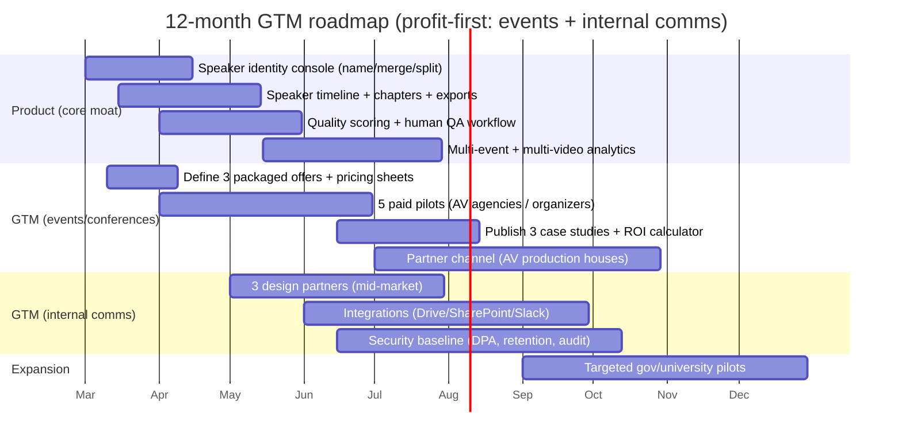

# Profit-First Competitive Landscape for Speaker-Aware Long-Form Video Segmentation

## Executive summary

A long‑form video → **speaker‑aware segmentation** engine built around **face-first identity** (persistent speaker recognition from video frames) with **audio diarization as a second layer** is best positioned to monetize where buyers pay for **time-to-publish**, **speaker accountability**, and **cross‑video analytics**—not merely transcripts or social clips. The most profitable near-term niches are **events/conferences with live streaming** and **enterprise internal communications**, because (a) they tolerate higher ACVs, (b) they have recurring content volume, and (c) incumbents are strong on platforms/hosting or meeting recaps but typically weaker on **identity-stable speaker timelines** across a content library. Event and enterprise platform pricing and procurement records show recurring fees in the **high four-figures to low five-figures per year and above** for event video platforms and civic meeting suites, demonstrating real price ceilings for “video workflow infrastructure,” not just creator tooling. citeturn0search0turn0search1turn6search1turn7search9

A profit-prioritized niche ranking (highest profit potential first, assuming minimal retuning is acceptable) is:

1) **Events/conferences with live streaming** (organizers, AV production companies, event marketing teams)  
2) **Enterprise internal comms** (corp comms, HR/L&D, sales enablement, internal all-hands)  
3) **Government/civic meetings** (agenda/meeting management ecosystems + public record)  
4) **Universities** (lecture capture + accessibility + compliance, slower procurement)  
5) **Legal** (high willingness-to-pay but heavy liability + biometrics risk + security expectations)  
6) **Podcast studios** (moderate ARPA; many tool chains; differentiable via identity + clipping packs)  
7) **Creators** (most crowded; low ARPA; high churn; useful mainly as product-led funnel) citeturn0search0turn0search1turn7search9turn8search2turn0search2

**Recommendation (profit-first):** start with **events/conferences** and a parallel, selective **mid‑market enterprise internal comms** motion using **paid pilots** and “deliverables-based” packaging (speaker-labeled chapters, highlight packs, and speaker analytics). Defer **legal** until you can offer strong privacy controls (consent-first biometric enrollment, strict retention, optional audio-only mode), because biometric regulations are materially riskier in places like entity["state","Illinois","us state"] and under **GDPR Article 9** when biometrics are used for unique identification. citeturn12search0turn11search3

## Method and evaluation framework

This report prioritizes **primary/official sources**: vendor pricing pages, vendor help centers, and public procurement documents (PDFs from municipalities/schools/universities). Where pricing is not publicly listed, it is stated as **unspecified / request pricing** (rather than inferred). citeturn4search3turn13search2turn6search1turn7search9turn8search2

Each niche is evaluated on:

- **Profit potential:** realistic ARPA (monthly/annual), ceiling, and expansion paths; anchored to observable pricing models (per seat, per registrant, annual license, per event). citeturn0search0turn0search1turn1search2turn2search1turn8search2  
- **Competitive intensity:** whether incumbents are entrenched and bundled (harder) vs fragmented toolchains (easier wedge). citeturn0search3turn1search0turn0search2  
- **GTM complexity / typical sales cycle:** mid-market vs enterprise vs public procurement, with cycle benchmarks drawn from published sales/procurement timing references. citeturn11search0turn11search1turn11search6  
- **Technical fit / retuning:** whether face-first identity is reliable (stable camera, recurring speakers) vs noisy (b-roll, off-camera speakers).  
- **Regulatory/privacy risk:** biometrics regimes (GDPR special category, BIPA, state biometric laws), and mitigation steps.

## Niche prioritization by profit potential

### ARPA and price ceilings across target niches

The table below provides **estimated** ARPA bands and ceilings based on observed vendor pricing models in each niche (per seat, annual license, per registrant). “Ceiling” means the upper end where buyers already pay for adjacent platforms or workflows, and where a differentiated “speaker-aware segmentation + analytics layer” can plausibly be sold.

| Niche | Profit potential (qualitative) | Realistic entry pricing (estimate) | Likely price ceiling (estimate) | Evidence anchors |
|---|---|---:|---:|---|
| Events/conferences (live streaming) | Highest | $1,500–$3,000/mo retainer **or** $2k–$10k per event | $10k–$50k+ per year (platform + services) | Per-registrant/annual pricing models exist (e.g., Kaltura Events priced by registrants). citeturn0search0turn13search2turn4search3 |
| Enterprise internal comms | Very high | $1,000–$5,000/mo (mid‑market teams) | $25k–$250k+/yr (enterprise rollouts) | AI and meeting suites are widely deployed; Copilot is priced per user/month, and Teams offers recaps/transcripts. citeturn0search3turn13search0 |
| Government/civic | High but slower | $15k–$50k/yr (add-on layer) | $100k+/yr (multi-module suites) | Annual license examples exist (Legistar $13,499.98; eScribe $14,220 year 1). citeturn0search1turn6search1 |
| Universities | High but slower | $15k–$75k/yr | $150k+/yr+ (by FTE/scale) | Contracts show annual license by FTE for video platforms (e.g., YuJa annual fees; Kaltura VC by FTE tiers). citeturn7search9turn0search0 |
| Legal | High but risky | $0.22–$1.85/min (service) **or** custom | High (service ecosystems) | Legal transcription services publish per-minute pricing; enterprise platforms request pricing. citeturn8search4turn16search1 |
| Podcast studios | Medium | $49–$300/mo | $500–$2,000/mo (studio/agency) | Podcast/video toolchains publish prices (Descript/Riverside/Submagic/OpusClip). citeturn2search1turn10view0turn2search3turn0search2 |
| Creators | Lowest | $15–$49/mo | ~$99–$149/mo | Creator clip tools and caption tools compete hard at low price points. citeturn0search2turn8search2turn2search3 |

### ARPA comparison “chart” (indicative)

| Niche | Indicative ARPA band | Relative scale |
|---|---:|---|
| Events/conferences | $2k–$10k+ / month-equivalent | ██████████ |
| Enterprise internal comms | $1k–$5k+ / month-equivalent | ████████ |
| Government/civic | $1.5k–$4k+ / month-equivalent | ███████ |
| Universities | $1.5k–$6k+ / month-equivalent | ███████ |
| Legal | highly variable | ███████ |
| Podcast studios | $50–$300+ | ███ |
| Creators | $15–$49 | ██ |

## Competitive landscape and pricing bands by niche

### Enterprise internal communications

**What buyers pay for:** searchable internal knowledge, faster comms, meeting/event recap, governance, and integrations. **Competitive dynamic:** strong incumbent bundling (meeting suites + AI add-ons), but a gap remains for **identity-stable speaker analytics across a video library** (e.g., “how often did Leader X speak last quarter?”) and for packaging outputs that look like post-production deliverables rather than “notes.” Teams explicitly supports event **recordings and transcripts** via recaps, and Copilot is priced per-user. citeturn13search0turn0search3

**GTM complexity / sales cycle:** mid-market deals often close in the **3–6 month** range and enterprise in **9–18 months** (benchmark guidance; varies). citeturn11search0

**Technical fit:** typically **high** if cameras are stable and speakers are recurring; medium if meetings are off-camera or screen-share heavy.

**Differentiation wedge:** “named-speaker timelines” + cross-video analytics using face-first identity; diarization used mainly to resolve voice-only sections and clean segmentation.

| Incumbent / product category | Pricing band (public) | Business model | Strengths | Weakness vs face-first + diarization wedge |
|---|---:|---|---|---|
| entity["company","Microsoft","productivity software company"] | Copilot Business shown at **$18/user/month** (annual) or **$25.20/user/month** (monthly commitment), separate base license required | Per-seat add-on | Deep ecosystem; Teams recaps include recordings/transcripts | Speaker identity stability across long internal video libraries is not a primary deliverable/outcome. citeturn0search3turn13search0 |
| entity["company","Zoom","video conferencing company"] | AI Companion: “included at no additional cost” with eligible paid services (availability caveats) | Bundled AI in suite | Distribution + adoption; webinar/event tooling | Bundled AI compresses pricing power; identity-stable speaker analytics is not the core product. citeturn1search0turn1search12 |
| entity["company","Otter.ai","ai meeting notes company"] | Pro listed from **$8.33/user/mo billed annually**; Business shows **$19.99/user/mo** (annual) and a higher monthly option; Enterprise is demo-based | Per-seat SaaS | Strong meeting note UX; searchable transcript corpus | Primarily audio-centric identity; not optimized for face-based identity continuity across a video archive. citeturn1search1 |
| entity["company","Fireflies.ai","ai meeting notes company"] | Pro **$10/seat/mo** (annual), Business **$19/seat/mo**, Enterprise **$39/seat/mo** (annual) | Per-seat SaaS | Integrations; meeting analysis | Similar constraint: identity stability + video deliverables not central. citeturn1search2turn1search6 |
| entity["company","MeetGeek","ai meeting assistant company"] | Pro **$9.99/user/mo** (page shows) | Per-seat SaaS | Meeting automation + summaries | Less oriented to “speaker packages” and persistent face-based identity. citeturn1search3 |
| entity["company","Sembly AI","ai meeting assistant company"] | Team plan stated as **$29/user/month** in official help article | Per-seat SaaS | Meeting intelligence workflows | Same wedge opportunity: identity continuity and post-production outputs. citeturn2search4 |

### Events and conferences with live streaming

**What buyers pay for:** registration, streaming reliability, sponsor value, analytics, and post-event content repurposing. Market pricing models include **per registrant**, **annual license**, and **request pricing** for enterprise event platforms. citeturn0search0turn13search2turn4search3

**GTM complexity / sales cycle:** ranges from fast (agencies buying toolchains) to mid-market (3–6 months) depending on integration and procurement. citeturn11search0

**Technical fit:** **high** for stages/panels where speakers are visible; face-first identity works especially well in podium/panel footage.

**Differentiation wedge:** deliver “speaker-aware deliverables” (session pages, speaker-labeled chapters, highlight clips per speaker, sponsor-ready clips) where existing event platforms are focused on running the event and attendee engagement.

| Incumbent / product category | Pricing band (public) | Business model | Strengths | Weakness vs face-first + diarization wedge |
|---|---:|---|---|---|
| entity["company","Kaltura","video platform company"] | Events package priced **£9,000 (up to 5,000 registrants)** and **£38,000 (up to 100,000)** in a public pricing document; includes REACH credits and content enrichment services (captioning, clipping, chaptering, metadata extraction) | Annual registrant-based | Enterprise video platform + event module; built-in AI enrichment | Content enrichment exists, but a specialized identity-first segmentation layer can still win on higher-accuracy speaker continuity and per-speaker analytics deliverables. citeturn0search0 |
| entity["company","ON24","webinar and virtual events company"] | “Request pricing” (Essentials/Standard/Advanced packages; prices not listed) | Sales-led (custom quote) | B2B webinar/events with analytics + AI marketing positioning | Pricing opaque; buyers may still need independent post-production pipeline (speaker-level clips and archives). citeturn4search3 |
| entity["company","Cvent","event management software company"] | Pricing described as **annual license fee + per registrant fee** (numbers not listed) | Sales-led + variable usage | End-to-end event marketing/management | Does not inherently solve identity-stable speaker segmentation as a standalone “content-as-asset” pipeline. citeturn13search2 |
| entity["company","StreamYard","live streaming software company"] | Core plan shown at **$44.99/mo** (individual plans; business plans separate) | Subscription (creator/SMB) | Easy browser production | Not a segmentation/analytics system; more about production. citeturn4search0 |
| entity["company","Restream","live streaming software company"] | Standard plan shows **$19/mo** (with annual discount options) | Subscription (SMB) | Multistreaming | Similar: production/distribution, not speaker-aware segmentation. citeturn4search1 |

### Government and civic meetings

**What buyers pay for:** agenda management, public records, transparency portals, captions/accessibility, and compliance. Public procurement documents show annual licensing and subscription fees in the **$10k–$40k+ range**, often before implementation. citeturn0search1turn6search1turn6search0turn6search17

**GTM complexity / sales cycle:** RFP cycles from posting to award average about **57 days** in one analysis (excluding pre-planning), but end-to-end procurement and implementation can be longer. citeturn11search1turn11search2

**Technical fit:** medium-to-high if speaker seats are visible and microphones are consistent; face-first can resolve messed-up diarization in council chambers.

**Differentiation wedge:** speaker-attributed clips and summaries by agenda item, “who said what” retrieval, and speaker analytics for public communications—positioned as an **overlay** rather than replacing core agenda tools.

| Incumbent | Pricing band (public) | Business model | Strengths | Weakness vs face-first + diarization wedge |
|---|---:|---|---|---|
| entity["company","Granicus","government software company"] | Example proposal shows **Legistar annual fee $13,499.98** | Annual license | Trusted civic agenda/meeting stack | Core focus is agenda/meeting management; speaker-aware video intelligence can be a bolt-on layer. citeturn0search1 |
| entity["company","eScribe Software","agenda management software company"] | Example subscription agreement summary: **$14,220 year one**, plus one-time implementation cited | Multi-year subscription | Meeting workflow + governance | Often lacks specialized “speaker identity continuity” outcomes; adding identity-first indexing can differentiate. citeturn6search1 |
| entity["company","Systems 3000, Inc.","board management software company"] | BoardDocs proposal lists **$2,700/yr (LT)** up to **$17,500/yr (Pro Plus)** + startup fee | Annual license | Board packet workflows at schools/boards | Not built as an advanced speaker-aware segmentation engine for video reuse/analytics. citeturn6search17 |
| entity["company","Prime Government Solutions","government meeting software company"] | City council packet references **PrimeGov agenda/meeting management $38,046** | Contract/license | Municipal meeting management | Opportunity for a specialized “speaker intelligence” layer that doesn’t replace core agenda workflows. citeturn6search0 |
| entity["company","CivicPlus","govtech company"] | “Request custom pricing” | Sales-led | Broad gov platform suite | Custom pricing and platform breadth can slow displacement; overlay approach fits. citeturn6search3 |

### Podcast studios

**What buyers pay for:** recording reliability, editing workflows, and rapid creation of short-form assets. Pricing is mostly SMB SaaS; an agency/studio tier can reach moderate ARPA. citeturn10view0turn2search1turn0search2turn2search3

**GTM complexity / sales cycle:** SMB product-led can be quick; studio/agency might be 2–8 weeks.

**Technical fit:** medium; frequent multi-camera changes and b-roll reduce face-first stability in some shows, but studio podcasts are often stable enough.

**Differentiation wedge:** persistent speaker identity across episodes enabling “host vs guest” analytics, speaker-based clip packs, and consistent attribution even when diarization splits speakers.

| Incumbent | Pricing band (public) | Business model | Strengths | Weakness vs face-first + diarization wedge |
|---|---:|---|---|---|
| entity["company","Riverside","podcast recording platform company"] | Pricing page shows tiers including **$24/month** and **$79/month**; business is contact sales | Subscription | Recording + repurposing features; webinar scale tiers | Identity-stable analytics across a library is not necessarily a primary deliverable; segmentation accuracy varies by format. citeturn10view0 |
| entity["company","Descript","audio and video editing company"] | Pricing shows **$16**, **$24**, **$50** per person/month (annual-billed equivalents shown) and enterprise custom | Per-seat SaaS | Editor-first workflow and collaboration | Editor-first tools still require humans to ensure consistent speaker identity over time; your engine becomes “automation-first.” citeturn2search1 |
| entity["company","OpusClip","ai video clipping company"] | Pricing shows **Starter $15/mo** and **Pro $29/mo**, Business custom | Credits subscription | Fast clip generation | Crowded “clipper” segment; speaker identity continuity and cross-episode analytics can differentiate premium tier. citeturn0search2 |
| entity["company","Submagic","ai captions company"] | Pricing shows **$19**, **$39**, **$69** per member/month | Per-seat SaaS | Captions and short-form polishing | More of a finishing tool than a speaker intelligence system. citeturn2search3 |

### Universities and higher education

**What buyers pay for:** lecture capture/video CMS, LMS integration, accessibility, and compliance. Procurement documents show annual licensing tied to student population (FTE) and multi-year renewals. citeturn0search0turn7search8turn7search9

**GTM complexity / sales cycle:** can take **months** due to RFP and stakeholder processes in higher education. citeturn11search6

**Technical fit:** high for lectures and panels with stable cameras; face-first identity helps in guest lecture series and multi-speaker events.

**Differentiation wedge:** beyond captions/transcripts, emphasize speaker attribution, “who taught what,” and speaker analytics across a catalog (especially for programs with rotating instructors).

| Incumbent | Pricing band (public) | Business model | Strengths | Weakness vs face-first + diarization wedge |
|---|---:|---|---|---|
| Kaltura (education platform modules) | Virtual Classroom priced by FTE tiers (example: **5,000 FTE = £10,500/yr**, higher tiers listed) in public document; Events module also priced by registrants | Annual license by scale | Enterprise education video stack + AI services | Platform breadth; your angle is a focused “speaker intelligence engine” that can integrate with existing video CMS. citeturn0search0 |
| entity["company","Panopto","video platform company"] | Example board packet references a **three-year contract totaling $27,000** | Contract / annual license | Lecture capture standard | Face-first speaker identity and analytics is typically not marketed as core; overlay opportunity. citeturn7search8 |
| entity["company","YuJa","enterprise video platform company"] | Contract shows **$14,800 annual fees** for a multi-year enterprise license; storage priced (example **$900/TB/yr**) | Annual license by FTE + add-ons | Compliance/accessibility positioning in regulated sectors | Similar: platform-first; opportunity for more advanced speaker-aware segmentation outputs. citeturn7search9 |
| entity["company","Echo360","education technology company"] | Pricing not published; request info / sales process (publicly visible) | Sales-led | Lecture engagement + capture ecosystem | Harder to displace; overlay integration strategy is safer. citeturn7search6turn7search10 |

### Legal

**What buyers pay for:** accuracy, defensible records, chain of custody, confidentiality, and sometimes certification. Business models include per-minute transcription services and enterprise-quoted platforms. citeturn8search4turn16search1turn16search0

**GTM complexity / sales cycle:** mid-to-long; procurement involves security review and risk/legal sign-off.

**Technical fit:** often medium; faces may be partially visible or off-camera; voice-only segments happen; identity misuse risk is high.

**Differentiation wedge (if pursued later):** speaker attribution in depositions/interviews where authorized participants are known and consented; avoid broader facial recognition and stick to **participant roster labeling**.

| Incumbent | Pricing band (public) | Business model | Strengths | Weakness vs face-first + diarization wedge |
|---|---:|---|---|---|
| entity["company","Lexitas","legal services company"] | Machine transcription **$0.22/min**; professionally edited & certified starting **$1.85/min** | Services per minute | Legal-grade positioning + services | High cost vs automation; your risk is compliance and achieving defensible workflows. citeturn8search4 |
| entity["company","Rev","transcription company"] | AI transcription can be **$0.008/min** with subscription; pay-per-minute AI pricing pages show **$0.25/min** | Subscription + pay-per-minute | Strong brand; multiple modes | Product is transcription-first; speaker-aware segmentation with face-first is non-trivial and risky in legal contexts. citeturn8search20turn8search23 |
| entity["company","VIQ Solutions","transcription technology company"] | Request pricing (no public numbers) | Sales-led | Enterprise/regulated sectors | Hard to beat on procurement trust; entry requires strong security + compliance posture. citeturn16search1 |
| entity["company","Veritext","legal services company"] | Pricing not listed; contact for rates | Services-led | Deposition workflow ecosystem | Displacement is difficult; wedge is a narrow automation module for speaker-attributed post-processing. citeturn16search0turn16search13 |

### Creators

**What buyers pay for:** “long → short” automation, captions, and distribution—at low monthly prices. This segment is crowded with aggressive pricing, credits, and viral marketing. citeturn0search2turn8search2turn2search3

**GTM complexity / sales cycle:** fastest to acquire, hardest to retain (churn and competition).

**Technical fit:** the noisiest video mix (b‑roll, jump cuts) reduces the advantage of face-first identity unless content is podcast‑style video.

**Differentiation wedge:** you can win only by (a) focusing on specific creator sub-verticals (e.g., multi-host podcasts, panel shows), or (b) using creators as top-of-funnel while monetizing agencies/teams.

| Incumbent | Pricing band (public) | Business model | Strengths | Weakness vs face-first + diarization wedge |
|---|---:|---|---|---|
| OpusClip | $15–$29/mo; business custom | Credits subscription | Sharp “clipper” positioning | Hard to differentiate without a niche; identity analytics not core. citeturn0search2 |
| Quso | $29–$49/mo tiers shown | Subscription | Clips + captions + scheduling suite | Competes on breadth; identity continuity is a possible differentiator for multi-speaker content. citeturn8search2 |
| Submagic | $19–$69 per member/month | Per-seat SaaS | Caption polish + short-form editing | Finishing tool; not an identity-first segmentation engine. citeturn2search3 |

## Go-to-market complexity and a profit-first approach

### Sales cycle expectations (practical benchmarks)

- Mid-market B2B software deals often close in **3–6 months**, enterprise in **9–18 months** (benchmark reference; actual varies). citeturn11search0  
- Public sector RFPs averaged **57 days from posting to award** in one analysis, excluding pre-planning. citeturn11search1  
- Higher-ed RFP/procurement efforts can take **months** due to drafting, proposal review, negotiation, and stakeholder coordination. citeturn11search6  

### Recommended initial niche focus (profit-first)

**Primary: events/conferences with live streaming**  
Rationale: (1) event platforms already monetize at high price points (per registrant, annual licenses), (2) post-production is routinely outsourced/expensive, (3) you can sell as **productized deliverables** without full enterprise integrations, and (4) face-first identity is unusually reliable on stages and panels. citeturn0search0turn13search2turn4search3

**Secondary: selective mid-market enterprise internal comms**  
Rationale: enterprises have tooling already (Teams/Zoom), but your wedge is **identity continuity and analytics** across a video knowledge base, plus automated “publisher-ready” outputs (chapters + speaker clips) vs “meeting notes.” Teams recaps show transcripts/recordings are table stakes; pricing pressure comes from bundling, so pitch as a *content operations accelerator* rather than a notetaker. citeturn13search0turn0search3turn1search0

### Twelve‑month GTM roadmap (mermaid timeline)

### Pilot structure (optimized for closing)

A profit-first pilot should be **paid, scoped, and conversion-linked**:

- **2–4 weeks**, with a defined content cap (e.g., 10–30 hours).  
- Deliverables: speaker-labeled chapters, per-speaker highlight candidates, transcript + captions, and a short analytics report.  
- Commercial: pilot fee credited toward a 6–12 month contract upon conversion.

## Unit economics and pricing architecture for chosen niches

### COGS assumptions (explicit)

These unit economics are illustrative and focus on marginal cost, not full company overhead (R&D, founder salary, sales commissions).

- **Transcription**: $0.006/minute using the diarization-capable model family (published pricing). citeturn3search0  
- **GPU compute**: NVIDIA T4 virtual workstation GPU price listed at **$0.55/hour** (used as a conservative “GPU-hours” proxy for face processing, embedding, and any GPU-accelerated steps). citeturn3search2  
- **Storage**: entity["company","Amazon Web Services","cloud provider"] S3 Standard first-tier listed at **$0.023/GB-month** (ignores requests/egress). citeturn3search3turn3search19  
- **Support/ops**: assumed and modeled as semi-variable per customer (depends heavily on onboarding and QA intensity).

### Offer design (recommended)

**Events / conferences (live streaming)**
- Retainer: $2,000/mo per organizer or AV agency (includes up to 40 hours processed/month)  
- Overage: per additional processed hour (set to protect margin)  
- Add-ons: sponsor clip packs, multilingual captions, speaker analytics exports

**Enterprise internal comms (mid-market)**
- $1,500/mo per org (includes up to 25 hours processed/month)  
- Add-ons: SSO, data residency, longer retention, admin analytics, audit exports

### Unit economics tables (1, 10, 50 clients)

Assumptions used in both scenarios:
- Processing intensity: **0.3 GPU-hours per 1 video-hour** processed (sampling frames, tracking, face embeddings, plus occasional re-processing).  
- Average encoded video stored: **2 GB per processed hour**; retention effects approximated via “average stored GB” per account.

#### Events/conferences plan (illustrative)

- Price: $2,000 / client / month  
- Included volume: 40 video-hours/month (2,400 minutes)

Per-client monthly variable costs (excluding support):
- Transcription: 2,400 min × $0.006 = **$14.40** citeturn3search0  
- GPU: 40 h × 0.3 × $0.55 = **$6.60** citeturn3search2  
- Storage (avg 160 GB): 160 × $0.023 = **$3.68** citeturn3search3  

| Clients | Revenue/mo | Transcription + GPU + storage | Support/ops assumption | Total COGS | Gross margin |
|---:|---:|---:|---:|---:|---:|
| 1 | $2,000 | ~$24.68 | $400 | ~$424.68 | ~78.8% |
| 10 | $20,000 | ~$246.80 | $2,000 ($200/client) | ~$2,246.80 | ~88.8% |
| 50 | $100,000 | ~$1,234.00 | $5,000 ($100/client) | ~$6,234.00 | ~93.8% |

#### Enterprise internal comms plan (illustrative)

- Price: $1,500 / client / month  
- Included volume: 25 video-hours/month (1,500 minutes)

Per-client monthly variable costs (excluding support):
- Transcription: 1,500 min × $0.006 = **$9.00** citeturn3search0  
- GPU: 25 h × 0.3 × $0.55 = **$4.13** citeturn3search2  
- Storage (avg 150 GB): 150 × $0.023 = **$3.45** citeturn3search3  

| Clients | Revenue/mo | Transcription + GPU + storage | Support/ops assumption | Total COGS | Gross margin |
|---:|---:|---:|---:|---:|---:|
| 1 | $1,500 | ~$16.58 | $500 | ~$516.58 | ~65.6% |
| 10 | $15,000 | ~$165.80 | $2,500 ($250/client) | ~$2,665.80 | ~82.2% |
| 50 | $75,000 | ~$829.00 | $6,250 ($125/client) | ~$7,079.00 | ~90.6% |

**Interpretation:** with modern transcription pricing and modest GPU usage, gross margin can be attractive even at relatively low ACVs—*provided you standardize onboarding and keep the face pipeline efficient*. citeturn3search0turn3search2turn3search3

### LATAM vs US market differences (commercial)

- In the entity["country","United States","country"], higher ARPA ceilings exist but buyers are more likely to demand security documentation, data processing agreements, and biometrics compliance posture (particularly where state laws and class-action risk are present). citeturn11search3turn12search5turn12search2  
- In Latin America, many buyers are more receptive to **fixed-fee pilots** and “done-with-you” onboarding, and price sensitivity can be higher—so bundling services into a productized monthly retainer often performs better than per-seat pricing early.

## Privacy and regulatory risk management for face-first identity

Face-first recognition can implicate **biometric data** when used to uniquely identify a person (even if you store embeddings rather than raw images). This expands legal obligations and threat models.

### Key regimes to consider (explicit)

- **GDPR Article 9** treats “biometric data for the purpose of uniquely identifying a natural person” as special category data with a general prohibition unless a condition applies. citeturn12search0  
- entity["state","Illinois","us state"] **BIPA (740 ILCS 14)** defines biometric identifiers including scans of face geometry and regulates collection/handling. citeturn11search3  
- entity["state","Texas","us state"] biometric identifier law requires notice and consent prior to capturing biometric identifiers; the state AG describes obligations. citeturn12search5turn12search1  
- entity["state","Washington","us state"] RCW 19.375 restricts enrolling biometric identifiers in a database for commercial purpose without notice/consent (or a mechanism to prevent subsequent use). citeturn12search2  
- entity["state","California","us state"] privacy guidance explicitly includes biometrics like facial recognition under personal information concepts, reinforcing notice/rights expectations for residents. citeturn12search3turn12search31  

### Risk mitigation plan (concise, actionable)

To keep your product sellable and reduce liability:

- **Consent-led speaker enrollment:** design the UX so customers explicitly create a “speaker roster” and confirm that enrolled speakers have been informed/consented (especially for employee/internal comms and private events). This aligns with consent expectations in Texas/Washington-style regimes and is prudent under GDPR special category logic. citeturn12search5turn12search2turn12search0  
- **Default to “known-speaker only” recognition:** prevent the system from building identities for audience members. Make “auto-enroll unknown faces” off by default; auto-detect faces only to associate segments, but do not persist identities unless approved.  
- **Data minimization and retention:** store embeddings and a limited set of reference thumbnails; apply short retention windows for raw frames; publish a retention schedule (especially relevant in BIPA-type frameworks). citeturn11search3turn12search2  
- **Offer an audio-only mode:** for legal and other sensitive use cases, provide diarization-only segmentation so customers can avoid biometrics. citeturn3search0  
- **Security posture packaged for B2B:** encryption at rest, access logging, per-tenant isolation, deletion workflows, and documented subprocessors; these are often table stakes for enterprise/public sector adoption.

**Bottom line:** events and enterprise internal comms are the strongest “profit-first” on-ramps because they let you sell a high-value workflow outcome (speaker-aware deliverables + analytics) while you build a compliance posture strong enough to pursue government, universities, and legal later. citeturn0search0turn13search0turn0search1turn11search0turn12search0