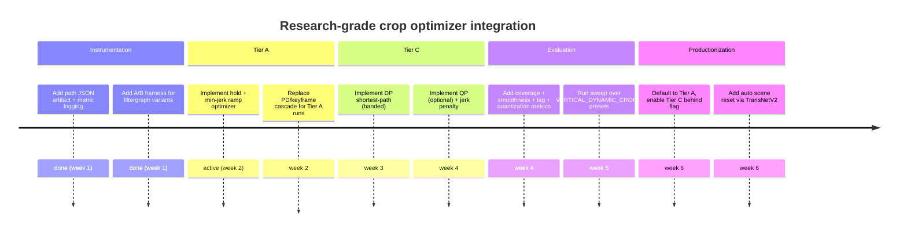

# Research-Grade Auto‑Reframe for Vertical Highlights: Papers‑to‑Code Map and Integration Plan

## Executive Summary

Your current stack (dense face tracking → several sequential smoothers/constraints → point simplification → spline → crop expression) is still vulnerable to “micro‑repositioning” because it continuously accepts small target updates and then expresses them through pixel-quantized crop coordinates, which can read as stepping once scaled to 1080×1920. A more research‑grade approach is to treat reframing as an **offline virtual‑camera optimization problem**: first compute a per‑frame “desired framing target” (face + torso bias + optional saliency/scene logic), then solve for a camera path that explicitly penalizes velocity/acceleration/jerk and (optionally) promotes sparse changes so it *looks intentional* (gimbal-like). The most directly applicable literature includes early “pan‑and‑scan” / shortest‑path / trained video cropping, plus later work on **L1‑optimal camera paths** and practical dataset-driven cropping pipelines; several have runnable code you can pull into your worker as drop‑in components. citeturn22search0turn25view1turn23search4turn22search20

## Research Map: Papers and Runnable Implementations

The table prioritizes papers that (a) directly optimize a cropping window trajectory, (b) explicitly address temporal coherence (jerk/flicker/lag), and (c) have runnable code or can be reimplemented faithfully in a few hundred lines.

| Priority | Paper (year) | Core method (what it actually optimizes) | Why it matters for your “jerky + behind” symptom | Runnable code / minimal example (or best available) |
|---:|---|---|---|---|
| 1 | **Video Retargeting: Automating Pan and Scan** (2006) | Defines a retargeting framework where each frame is cropped then scaled; the “camera” is a path constrained over time to preserve important content. citeturn22search0 | This is the canonical formulation for **virtual camera motion**: you can translate your face‑track (and torso bias) into an “importance” term, then solve a global path that avoids micro‑updates. citeturn22search0 | No official repo in the project page/PDF. Implement Tier‑C DP/QP below as a faithful modern equivalent (uses your existing track + constraints). citeturn22search0 |
| 2 | **Pan, Zoom, Scan – Time‑coherent, Trained Automatic Video Cropping** (2008) | Time‑coherent tracking of a cropping rectangle with penalties for jump/zoom/aspect/center; supports direct saliency + optical‑flow cues or learned cue fusion. citeturn23search0turn25view1 | It operationalizes what you want: **long smooth moves + explicit jump penalties**, including knobs like jump width and delay/chunking that resemble your “hold/ramp”. citeturn25view1 | Authors provide a release tarball + CLI tool `vidzoom` with example invocations. citeturn24view0turn25view1 |
| 3 | **Multi‑Scale Video Cropping** (2007) | Models “information content” (frame differences) and finds a **globally optimal cropping trajectory via shortest path**; also proposes a second shortest‑path for good cuts between trajectories. citeturn20search0 | This is directly aligned with Tier‑C “global DP” for crop centers: shortest path is a clean way to enforce smoothness and eliminate micro jitter while remaining predictable. citeturn20search0 | No official repo found in the accessible record; implement as DP shortest path over candidate centers (Tier‑C). citeturn20search0 |
| 4 | **Auto‑Directed Video Stabilization with Robust L1 Optimal Camera Paths** (2011) | Solves for camera motion paths using robust L1 optimization (promoting piecewise‑smooth, intentional motion) rather than “always reactive” smoothing. citeturn22search20 | Your complaint “it’s always behind / trying to catch up” often comes from **causal smoothing**; L1‑optimal offline paths can look deliberate and reduce “chatter.” citeturn22search20 | Paper PDF is available; code is not bundled in the PDF. Use the Tier‑C “min‑jerk + L1/Huber jerk penalty” QP approach as the closest pragmatic implementation. citeturn22search20 |
| 5 | **A Fast Smart‑Cropping Method and Dataset for Video Retargeting** (2021) | Uses saliency + filtering‑through‑clustering to select main focus; explicitly discusses temporal smoothing choices (LOESS vs Savitzky‑Golay) and stability mechanisms. citeturn23search4turn6view0 | Useful as a proven, practical Tier‑B baseline: saliency clustering + stability filters are specifically designed to avoid sudden focus changes; the repo also contains evaluation tooling ideas. citeturn5view0turn6view0 | Code is available (`smartVidCrop.py`, evaluation script, and dataset annotations scaffold). citeturn5view0turn10view0 |
| 6 | **TransNet V2: fast shot transition detection** (2020) | Shot boundary detection network with inference tooling and a dockerized workflow. citeturn17search14turn28view0 | For your pipeline, shot segmentation is the cleanest way to reset state and avoid “dragging” across cuts (a common source of perceived lag/incorrect framing). citeturn28view0 | Fully runnable inference (TensorFlow + Docker + CLI). citeturn28view0turn28view1 |
| 7 | **AutoShot: short‑video shot boundary dataset + SOTA SBD** (2023) | Releases a short‑video SBD dataset and provides an evaluation script + baseline artifacts. citeturn28view3turn13academia33 | If you want shot segmentation tuned for short‑form/social video (your domain), this is a strong benchmark complement to TransNetV2. citeturn28view3 | Repo provides dataset pointers and a concrete evaluation script (`compare_inference_baseline_groundtruth_v2.py`). citeturn28view3 |
| 8 | **MoCrop: Training‑free motion‑guided cropping** (2025) | Finds motion‑dense regions (from motion vectors) and produces a crop strategy; includes scripts for training/testing and a reproducible notebook. citeturn13academia30turn29view1 | Even if you stay face‑first, motion density can be a robust fallback when faces are missed/occluded, and can feed Tier‑B candidate selection. citeturn29view1 | Repo includes `scripts/train.py`, `scripts/test.py`, and `src/mocrop_dataset.py` with explicit commands. citeturn29view1 |
| 9 | **Unsupervised Action Localization Crop in Video Retargeting for 3D ConvNets** (2021) | Detects per‑frame motion patches then fits a **polyBezier trajectory** through pivot timestamps to avoid jitter/flicker. citeturn13academia32 | The important part for you is not action recognition; it’s the explicit “fit a smooth curve through pivots,” which matches your desire for fewer updates + eased moves. citeturn13academia32 | No repo link in the arXiv record; implement via Tier‑A “hold + quintic min‑jerk ramps” or Tier‑C “global spline with constraints.” citeturn13academia32 |

### Minimal commands for the items with runnable code

**Pan, Zoom, Scan (2008) code package** (authors’ CLI + README). citeturn24view0turn25view1

```bash
# download the release referenced by the project page
wget -O vidzoom.tgz https://thomas.deselaers.de/research/files/vidzoom-release-v1.0.tgz
tar -xzf vidzoom.tgz
cd vidzoom-release-v1.0

# build (Linux Makefile per README)
make

# example: direct saliency + optical flow, limited jump, allow zooming out, chunk optimization, dump output frames
./vidzoom --salDirect --OFDirect -J 2 -Z 0.3 --trackingPredecessorZoomPenalty=0.0001 -W 540 -H 360 -D 100 --output-file-images VIDEO.avi
```

The README also documents a “purely feature driven” mode and explains the trade‑offs (e.g., why zooming can look bad without smoothing penalties). citeturn25view1

**SmartVidCrop / RetargetVid (2021)** (practical baseline + evaluation structure). citeturn5view0turn10view0turn23search4

```bash
git clone https://github.com/bmezaris/RetargetVid.git
cd RetargetVid

# The repository's main entry point is smartVidCrop.py; by default it expects DHF1k videos laid out
# under RetargetVid/DHF1k/ (see __main__ in the file).
python smartVidCrop.py
```

The repo explicitly notes the algorithmic update that replaced LOESS with a Savitzky–Golay filter in the “best settings” configuration for smoother motion. citeturn6view0turn10view0

**TransNetV2 (2020)** (shot boundary detection for segment resets). citeturn28view0turn17search14

```bash
git clone https://github.com/soCzech/TransNetV2.git
cd TransNetV2

# simplest (TensorFlow inference)
pip install tensorflow==2.1
sudo apt-get install -y ffmpeg
pip install ffmpeg-python pillow

# run the inference script
python inference/transnetv2.py /path/to/video.mp4 --visualize
# or install as a package and use the CLI helper:
# python setup.py install
# transnetv2_predict /path/to/video.mp4 --visualize
```

The inference README describes the output files (scenes list, raw predictions, and optional visualization), and provides a GPU‑enabled Docker invocation. citeturn28view0turn26view0

**AutoShot (2023)** (dataset + evaluation workflow). citeturn28view3turn13academia33

```bash
git clone https://github.com/wentaozhu/AutoShot.git
cd AutoShot

# Main evaluation flow per README:
# 1) download/unzip dataset artifacts
# 2) fix folder merges
# 3) set YOURDOWNLOADDATAPATH in compare_inference_baseline_groundtruth_v2.py
# 4) place baseline ckpt + pickled predictions where README expects
python compare_inference_baseline_groundtruth_v2.py
```

The README is explicit about file names, merge steps, and the evaluation script entry point. citeturn28view3

**MoCrop (2025)** (motion‑vector based cropping module; code is explicit about where the core logic lives). citeturn29view1turn13academia30

```bash
git clone https://github.com/microa/MoCrop.git
cd MoCrop
conda create -n mocrop python=3.8
conda activate mocrop
pip install torch torchvision opencv-python numpy tqdm fvcore matplotlib Pillow scipy scikit-learn

# train (example from README)
python scripts/train.py --arch resnet50 --train-mode mocrop --epochs 100 --batch-size 32

# test
python scripts/test.py --arch resnet50 --test-mode mocrop --model-path path/to/model.pth
```

The README calls out the project structure and the primary entry points (`src/mocrop_dataset.py`, `scripts/train.py`, `scripts/test.py`). citeturn29view1

## Optimizer Designs for Your Pipeline

This section proposes **three tiers** that can be integrated without replacing your tracking, and are explicitly designed to solve what you described:

- “Still jerky, maybe because it is more frequent” → too many small corrections are being surfaced.
- “Always behind” → the smoother is acting like a chasing controller with phase lag (common when you cascade causal filters and then constrain accelerations). This is exactly why the reframing literature uses global optimization / chunked traceback / or learned/penalized trajectories. citeturn25view1turn22search20

### Tier A: Scene‑stationary with sparse updates and min‑jerk ramps

**Goal:** Make the camera behave like a human operator: hold a shot, then move smoothly, then hold again.

**Core idea:** Replace continuous target‑following with:  
(1) **hold** the crop center until drift exceeds a threshold, then  
(2) do a fixed‑duration **ease** movement (quintic “minimum jerk” ramp), then  
(3) hold again.

This is strongly consistent with “delay/chunked traceback” concepts in the Pan‑Zoom‑Scan implementation (their `-D` option) and with L1‑style sparse camera path strategies. citeturn25view1turn22search20

**Algorithm sketch matched to your variables**

Let:

- `fps = 30`, `dt = 1/fps`.
- `target[t] = (tx[t], ty[t])` from your existing identity‑anchored tracker.
- `deadband = VERTICAL_DYNAMIC_CROP_DEADBAND` (normalized or pixels; see parameter section).
- `ramp_sec` (new env) or reuse `motion_dt`/`keyframe_sec`.
- `max_delta_per_sec`, `max_accel_per_sec2` remain as hard clamps.

Pseudocode (single axis shown; do x and y independently):

```python
state = HOLD
cx = tx[0]
vx = 0

for each frame t:
    err = tx[t] - cx

    if state == HOLD:
        if abs(err) <= deadband:
            cx = cx  # hold
        else:
            # start a move: latch destination
            x0 = cx
            x1 = clamp_to_limits(tx[t])
            t0 = t
            state = RAMP

    if state == RAMP:
        u = (t - t0) / (ramp_sec * fps)
        if u >= 1:
            cx = x1
            state = HOLD
        else:
            # quintic smoothstep (min-jerk style, zero vel/acc at endpoints)
            s = 10*u**3 - 15*u**4 + 6*u**5
            cx = x0 + (x1 - x0)*s

    cx = enforce_vel_acc_limits(cx, max_delta_per_sec, max_accel_per_sec2, dt)
```

**Complexity:** O(T).  
**Pros:** Very predictable; extremely good at suppressing micro‑movement; easiest to explain/debug.  
**Cons:** Can feel “robotic” if ramps are too short or deadband too small; needs careful torso/headroom constraints to avoid holding a bad composition. (This is still far less complex than your current PD+keyframe+spline cascade.)

### Tier B: Saliency‑assisted candidate selection + stability filtering

**Goal:** Improve “subject selection” and “shot choice” so the optimizer has a better target to track, especially when faces are small, occluded, or not the true main subject.

**Core idea:** Use a light saliency or motion‑density signal to propose regions of interest; cluster them; pick a dominant cluster and pass it through a stability mechanism before tracking.

This is essentially the idea behind SmartVidCrop’s saliency‑based selection and filtering‑through‑clustering (and its additional stability mechanisms in the later configuration). citeturn5view0turn6view0turn23search4

**Where to plug in:** Before your smoothing stack, produce a per‑frame `target_center` that is *already stable*, then run Tier A or Tier C for final motion shaping.

**Practical recipe (compatible with your identity anchoring)**

1. For each frame, compute candidates:
   - Face‑based center candidates (existing).
   - Optional saliency peak/centroid candidates (SmartVidCrop‑style). citeturn5view0turn23search4
   - Optional motion‑density candidate (MoCrop‑style idea, without doing action recognition). citeturn29view1

2. Cluster candidates across a short temporal window (e.g., 0.5–1.0s) and choose the cluster that maximizes a weighted score:
   - face identity weight (your existing `identity_min_sim`, `active_id_weight`)
   - size/quality (face size, detection confidence)
   - saliency/motion density
   - “stability” reward (penalize frequent cluster switching)

3. Output a single `tx[t], ty[t]` per frame.

4. Feed `tx,ty` into Tier A or Tier C.

**Complexity:** O(T * K) with small K candidates; clustering can be windowed.  
**Pros:** Better subject choice; naturally rejects spurious face jumps; handles “main focus is not the face” cases.  
**Cons:** More moving parts; requires extra models (unless you keep candidates entirely from your tracker).

### Tier C: Global min‑jerk / shortest‑path / constrained optimization (recommended)

**Goal:** True “gimbal‑like” camera motion: smooth, low‑frequency, and not lagging behind, because it’s optimized over the full highlight. This is the most faithful to the formulation of pan‑and‑scan retargeting and shortest‑path video cropping. citeturn22search0turn20search0

There are two practical Tier‑C implementations that work well in production:

#### Tier C1: Discrete shortest‑path / Viterbi DP over candidate positions

This directly mirrors “shortest path” approaches. citeturn20search0

1. Discretize candidate centers:
   - Either a fixed grid in normalized space (e.g., step ≈ 0.002–0.005),
   - Or only the set of plausible centers around your target (banded to respect `max_delta_per_sec`).

2. Define per‑frame cost:
   - Data term: distance to target center, weighted by track confidence.
   - Motion terms: penalties on velocity and acceleration (and optionally jerk).

3. Solve with DP with a band constraint (max velocity) to keep it fast.

**Complexity:** O(T * N * B) with band width B, rather than O(T * N²).

#### Tier C2: Quadratic program / convex optimization on the full path

This is closer in spirit to robust camera path optimization (L1/L2 tradeoffs) and gives you continuous solutions that can be keyframed cleanly. citeturn22search20

Minimize:

- Fidelity:  Σ w[t] · (c[t] − target[t])²  
- Smoothness: Σ α · (Δc[t])² + β · (Δ²c[t])² + γ · (Δ³c[t])²  
- Sparsity (optional): λ · Huber(Δ²c[t]) or λ · |Δ³c[t]|  

Subject to:

- |Δc[t]| ≤ vmax · dt   (maps from `max_delta_per_sec`)
- |Δ²c[t]| ≤ amax · dt² (maps from `max_accel_per_sec2`)
- Crop bounds (center must keep crop inside frame)
- Headroom/torso constraints (see torso section)

**Why this is likely to fix your “behind / chasing focus” critique:**  
Your current multi-stage causal smoothing behaves like a tracking controller; offline optimization removes phase lag because the solution is not constrained to be causal. That’s exactly the motivation behind global path approaches and the chunked traceback idea used in Pan‑Zoom‑Scan. citeturn25view1turn22search20

## Integration Plan into Your Existing Pipeline

This plan keeps your architecture (InsightFace → `autocrop.py` → `buildCenterExpr` → crop expression), but inserts a **single explicit reframing optimizer** that outputs either (a) piecewise polynomial segments or (b) keyframes + a known easing policy.

### Data contracts and JSON outputs

Add a new intermediate JSON artifact (write it next to your existing track JSON to make debugging easy).

**Proposed JSON schema (v1)**

```json
{
  "version": 1,
  "fps": 30,
  "source": {"w": 640, "h": 360},
  "target": {"w": 1080, "h": 1920},
  "crop": {"w": 1080, "h": 1920, "mode": "scale_then_crop"},
  "optimizer": {
    "tier": "C",
    "params": {
      "deadband": 0.02,
      "ramp_sec": 0.45,
      "vmax_norm_per_sec": 0.20,
      "amax_norm_per_sec2": 0.12,
      "jerk_weight": 1.0,
      "sparsity_weight": 0.5
    }
  },
  "tracks": {
    "raw_target": [{"t":0.0,"x":0.51,"y":0.43,"conf":0.9}],
    "biased_target": [{"t":0.0,"x":0.51,"y":0.53,"conf":0.9}]
  },
  "path": {
    "keyframes": [{"t":0.0,"x":0.50,"y":0.55},{"t":1.2,"x":0.62,"y":0.55}],
    "segments": [
      {"t0":0.0,"t1":1.2,"ease":"minjerk_quintic","x0":0.50,"x1":0.62,"y0":0.55,"y1":0.55}
    ]
  },
  "metrics": {
    "smoothness": {"jerk_rms": 0.0031},
    "coverage": {"face_in_crop_ratio": 0.98},
    "lag": {"xcorr_lag_sec": 0.00}
  }
}
```

This mirrors how the TransNetV2 inference tool writes both scene lists and raw predictions for transparency. citeturn28view0

### Changes in `apps/worker/src/pipeline/python/autocrop.py`

Add a single entry point (names illustrative):

```python
def optimize_camera_path(
    raw_targets_xy: list[tuple[float, float, float]],  # (t_sec, x_norm, y_norm)
    frame_w: int,
    frame_h: int,
    fps: float,
    env: dict
) -> dict:
    """
    Returns:
      {
        "keyframes": [...],
        "segments": [...],
        "debug": {...}
      }
    """
```

Implementation steps:

1. **Compute `biased_target`** per frame (section “Torso bias” below).
2. **Scene segmentation hook (optional but high leverage)**:
   - Call TransNetV2 once per highlight segment and split optimization across detected scenes (reset path each scene). citeturn28view0turn17search14
3. **Run the selected tier**:
   - Tier A: hold + min‑jerk ramp.
   - Tier B: candidate selection + Tier A or C.
   - Tier C: DP/QP for global path.
4. **Keyframe extraction**:
   - Replace or complement RDP by extracting keyframes at (a) scene boundaries, (b) path curvature peaks, and (c) times where held‑shot flips to ramp.
5. Output JSON as above for TS to consume.

### Changes in `apps/worker/src/test-render-highlights-isolated.ts`

Add a new builder that consumes `segments[]` instead of dense spline control points.

**API shape**

```ts
type CropSegment = {
  t0: number; t1: number;
  ease: 'minjerk_quintic' | 'linear';
  x0: number; x1: number;
  y0: number; y1: number;
};

function buildCenterExprFromSegments(
  segments: CropSegment[],
  axis: 'x' | 'y',
  opts: { clampMin?: number; clampMax?: number }
): string;
```

**How to encode min‑jerk in an expression (conceptually)**  
For a segment `[t0,t1]`, define `u = (t-t0)/(t1-t0)` clamped to [0,1], and use:

- `s(u) = 10u^3 − 15u^4 + 6u^5` (quintic smoothstep)

Then `x(t) = x0 + (x1-x0) * s(u)`.

This is a standard minimum‑jerk time law and is consistent with the literature’s emphasis on temporally coherent, smooth motion. citeturn22search20turn13academia32

### Filtergraph changes

You asked specifically for “upscale-before-crop” and concrete crop expression changes.

**Recommended rendering order for your 640×360 → 1080×1920 case**

- Scale input so the **intermediate height equals target height** (1920).
- Then crop to 1080×1920 using the optimized center expression (in the scaled coordinate system).
- Avoid an additional scale after crop unless you need a specific scaler or SAR fix.

This aligns with the general retargeting pipeline structure (make a window selection, then produce the output framing). citeturn22search0

Example filtergraph sketch (you will substitute your `x_expr` / `y_expr`):

```bash
-vf "
  scale=-2:1920,
  crop=1080:1920:x='X_EXPR':y='Y_EXPR',
  setsar=1
"
```

If you do not want vertical panning (common when converting 16:9 → 9:16 without zoom), you can set `y=0` and only optimize `x`. Your existing artifacts suggest you *are* effectively panning/zooming in some way; the tiered design supports both x-only and x+y. (This is an integration choice, not a paper claim.)

## Parameter Ranges and Automated Torso Bias

These ranges are intended for **30 fps** and “portrait from landscape” reframing, where visible stepping is especially noticeable.

### Parameter ranges by tier

**Tier A (hold + min‑jerk ramps)**

- Hold threshold (`deadband`): start at 0.015–0.03 in normalized coordinates.
  - If you implement “scale‑then‑crop,” consider converting the deadband to **output pixels** instead (e.g., 6–12 px) because that directly matches what viewers perceive.
- Ramp duration (`ramp_sec`): 0.35–0.7 s.
  - Shorter ramps look twitchy; longer ramps risk feeling sluggish.
- Velocity clamp (`max_delta_per_sec`): 0.10–0.25 (normalized / sec).
- Acceleration clamp (`max_accel_per_sec2`): 0.05–0.15 (normalized / sec²).

These are consistent with the motivation of time‑coherent cropping: penalize/limit jumps and force coherence. citeturn25view1turn23search0

**Tier B (saliency/motion candidates + stability)**

- Temporal candidate window: 0.5–1.2 s.
- Cluster switch hysteresis: require dominance for 0.6–1.0 s before switching.
- “Focus stability” / “reject sudden focus changes”: enable a mechanism analogous to what SmartVidCrop describes, then apply Tier A/C. citeturn6view0turn5view0turn23search4

**Tier C (global DP/QP)**

- Data vs smoothness:
  - Increase smoothness until the path’s RMS acceleration/jerk visibly stops producing micro motion.
  - Add a sparsity term (Huber/L1 on acceleration or jerk) if the path still “wiggles.”
- Max velocity / max acceleration should map directly from your existing `max_delta_per_sec` and `max_accel_per_sec2`, but Tier C typically tolerates larger raw limits because the optimizer chooses not to use them unless needed.

The shortest‑path formulation in Multi‑Scale Video Cropping and the global optimization spirit in pan‑and‑scan retargeting support this framing. citeturn20search0turn22search0

### Automated torso bias with safe headroom

You want “include more torso, not face dead-center.” Two low-cost strategies fit your pipeline:

**Face-box proportional offset (recommended first)**  
If you have face bounding boxes from the tracker:

- Let `face_cy` be face center y in normalized coordinates.
- Let `face_h` be face box height in normalized coordinates (relative to frame height).
- Define:

  - `torso_bias = k * face_h`, with k typically 0.8–1.4 depending on how tight your crop is.
  - `y_target = face_cy + torso_bias`

- Enforce “headroom safe” constraints:
  - Ensure the top of the crop window stays above `face_top − headroom_margin`, where `headroom_margin` might be 0.05–0.12 of crop height.

This is consistent with the way practical systems reason about framing targets: derive a target window from detected subject geometry, then optimize temporal coherence around it. citeturn22search0turn23search0

**Composition model / saliency anchor (Tier B extension)**  
If you adopt a saliency signal (SmartVidCrop‑style), you can pull the target down when the saliency mass includes torso/arms, but keep a “head top must be inside” hard constraint. citeturn23search4turn5view0

### Should you quantize/hold the center for ≥N frames and ramp?

Yes, and the literature repeatedly “rediscovered” this in different guises:

- Pan‑Zoom‑Scan explicitly exposes per‑frame jump limits, chunked traceback, and penalties to avoid ugly zoom/jump behavior. citeturn25view1turn23search0
- L1‑optimal camera path work is largely about making motion *sparse and intentional* instead of continuously reactive. citeturn22search20

In your environment knobs, this maps cleanly to:

- Increase `deadband`.
- Replace high‑frequency PD chasing with hold/ramp logic (Tier A), or make Tier C the “truth” and delete the PD stage.
- Make `keyframe_min_move` larger and force a minimum `keyframe_max_hold_sec` (but do it at the optimizer stage, not after the fact).

## Evaluation Plan and Comparison Scripts

You asked for metrics that match the failure modes: coverage, motion energy, perceived lag, and pixel quantization artifacts.

### Metrics

**Coverage / content integrity**

- Face inclusion ratio: fraction of frames where the face bounding box is fully inside the crop.
- Face margin stats: distribution of top margin (headroom) and bottom margin (torso space).

RetargetVid evaluates crop quality using IoU against human annotations; the structure is a good template even if your “ground truth” is face coverage rather than manual crops. citeturn5view0turn23search4

**Motion energy and smoothness**

Compute on the final crop center path `c[t]` (in output pixels or normalized):

- Velocity RMS: √mean((Δc/dt)²)
- Acceleration RMS: √mean((Δ²c/dt²)²)
- Jerk RMS: √mean((Δ³c/dt³)²)

Tier C is designed to minimize these directly. citeturn20search0turn22search20

**Perceived lag (“behind the subject”)**

If `target[t]` is your desired center and `c[t]` is produced path:

- Compute cross‑correlation between `target` and `c` and report the lag at peak correlation (seconds).
- Alternatively, measure event alignment: for frames where target changes rapidly (>|threshold|), measure time until crop reaches within ε.

This directly tests the “always behind” complaint and distinguishes “smooth but laggy” from “smooth and responsive.”

**Pixel quantization / stepping artifacts**

A practical detector:

- Count frames where `floor(x[t]) == floor(x[t-1])` for long stretches followed by single‑pixel jumps (a “staircase” signature), then measure the peak-to-peak output displacement after scaling.

This is especially relevant for portrait conversions because horizontal crop steps can be visually amplified after resizing (this is an engineering hypothesis to verify with A/B outputs, not a paper claim).

### Comparison script outline

Add a small worker-side tool (Python is easiest given your pipeline) that consumes:

- `raw_track.json` (your InsightFace centers)
- `optimized_path.json` (new artifact)
- optional `face_boxes.json`

and outputs a metrics JSON plus plots.

CLI sketch:

```bash
python tools/eval_reframe.py \
  --fps 30 \
  --source 640 360 \
  --target 1080 1920 \
  --track apps/test_data/.../track.json \
  --path apps/test_data/.../optimized_path.json \
  --out apps/test_data/.../metrics.json
```

Tie it into your existing `test-render-highlights-isolated.ts` run so every render writes both the video and the metrics sidecar.

## Timeline, Effort/Quality Table, and Implementation Milestones

### Milestones timeline



TransNetV2 integration is explicitly supported by its inference tooling and dockerized workflows, which reduces risk of adding it into a worker pipeline. citeturn28view0turn26view0

### Effort vs expected quality table (papers/repos mapped to practical options)

| Option | What you integrate | Effort | Expected smoothness | Expected “not behind” | Notes / mapping to research |
|---|---|---:|---:|---:|---|
| Tier A | Hold + quintic ramp | Low | High | Medium–High | Matches the “intentional camera move” philosophy; easiest to ship safely. citeturn25view1turn22search20 |
| Tier B | Candidate selection + Tier A/C | Medium | High | High | Most robust when faces are not the true focus; aligns with practical saliency+clustering pipelines. citeturn23search4turn5view0 |
| Tier C1 | DP shortest path over candidates | Medium–High | Very high | Very high | Directly mirrors shortest‑path video cropping formulations. citeturn20search0 |
| Tier C2 | QP/convex min‑jerk with constraints | High | Very high | Very high | Closest to robust, global camera path optimization; cleanly enforces vmax/amax. citeturn22search20 |
| External baseline | SmartVidCrop | Medium | Medium–High | Medium | Great reference for saliency‑driven focus stability and smoothing choices. citeturn6view0turn10view0turn5view0 |
| External component | TransNetV2 scenes | Low | Indirect | Indirect | Resets across cuts prevent “dragging” and accidental lag across scene changes. citeturn28view0turn17search14 |
| External component | MoCrop motion density | Medium | Indirect | Indirect | Strong fallback cue for “no face found” cases; integrate as Tier‑B candidate. citeturn29view1turn13academia30 |

### Recommended default path to ship

- **Default**: Tier A (hold + min‑jerk ramps) + “scale‑then‑crop” filtergraph + torso bias (face-box proportional). This is the fastest path to eliminate micro‑movement while improving composition.
- **Next**: Add scene resets using TransNetV2 inference.
- **Best quality**: Tier C1 (DP shortest path) once your evaluation harness is in place; it is the most directly supported by the classic reframing/cropping literature and should resolve both “jerky” and “behind” when tuned. citeturn22search0turn20search0turn28view0turn25view1turn22search20