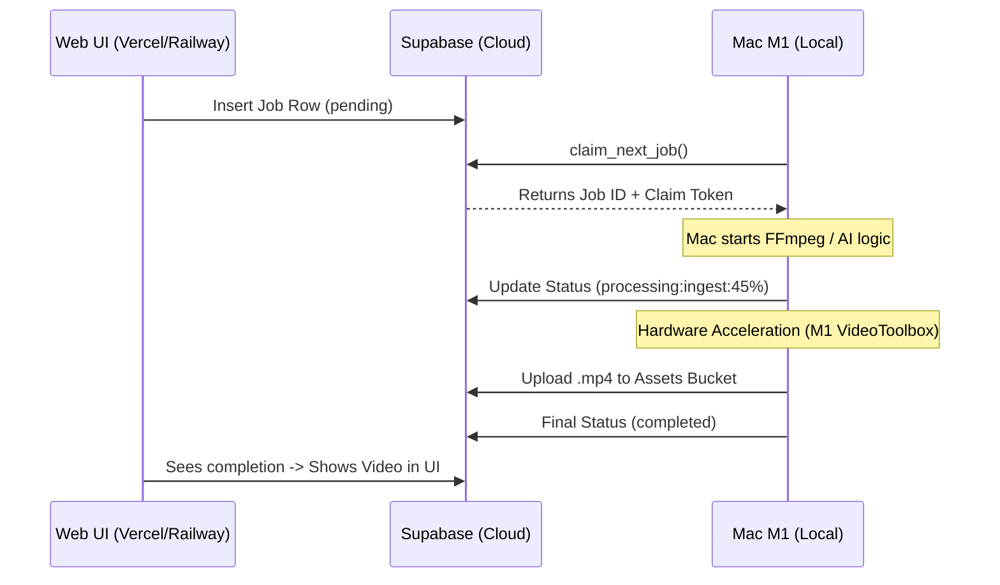

# CDV Mac M1 Worker Architecture

This document describes the high-performance local worker setup for Apple Silicon (M1/M2/M3) hardware.

---

## 1. De-centralized Muscle Pattern

The CDV architecture uses a **Pull-based** worker model. Instead of a cloud server pushing work to your Mac, your Mac acts as an independent "muscle" that pulls jobs from the Supabase cloud.

### The "Listen" & Claim Mechanism
The worker runs an atomic polling strategy to ensure no two workers (e.g., your Mac and a Colab instance) ever process the same job.

*   **Polling Loop:** The worker runs a continuous `while(true)` loop (defined in `apps/worker/src/index.ts`) that calls the `claim_next_job` RPC function every 10 seconds.
*   **Atomic Claim:** Supabase looks for jobs where `status = 'pending'`, assigns the worker's unique `WORKER_ID`, and flips the status to `processing`. Because this happens inside a single database transaction, it is thread-safe and impossible to double-claim.

---

## 2. Interaction Flow



---

## 3. Security & Connectivity

*   **Zero Inbound Ports:** Your Mac does not need a static IP, a public domain, or open firewall ports. Since it initiates all connections *out* to Supabase, it stays protected behind your router's NAT.
*   **Credential Isolation:** The worker uses the `SUPABASE_SERVICE_ROLE_KEY`. This sensitive key is stored in your local `.env.local` file, which is specifically ignored by Git to prevent it from ever being leaked to GitHub.
*   **Encrypted Pipeline:** All communication (job metadata, transcripts, and raw video bytes) is transmitted via **TLS 1.3 encryption**.

---

## 4. Permanency with PM2

To run the worker as a robust background service that survives reboots and automatically restarts after crashes, use **PM2**.

### Installation
```bash
npm install -g pm2
```

### Setup & Launch
Navigate to the worker directory on your Mac and run:
```bash
# Path: /Volumes/SSD Daniel/CDV/apps/worker
pm2 start --name "cdv-worker" "pnpm run dev"
```

### Management Commands
| Command | Description |
|---|---|
| `pm2 status` | Check if the worker is running |
| `pm2 logs cdv-worker` | View live FFmpeg progress and logs |
| `pm2 save` | Make the worker start automatically after a Mac reboot |
| `pm2 stop cdv-worker` | Pause the worker |
| `pm2 restart cdv-worker` | Force a refresh after code changes |

---

## 5. M1 Performance Tuning

The worker automatically detects your Mac platform and switches to **VideoToolbox** hardware acceleration for FFmpeg. This uses the dedicated "Media Engine" on your M1 chip, allowing you to render 4K video with nearly 0% CPU impact.
